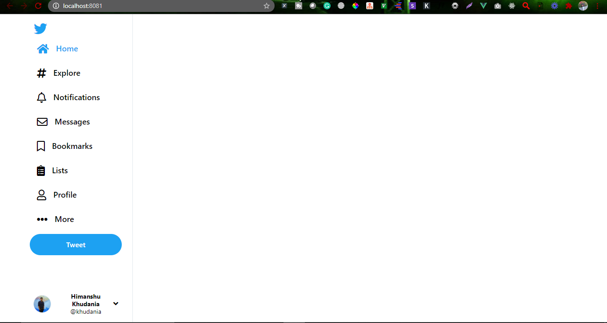

# Twitter Demo Project

## Project setup

### Minimum requirement for the project is 'Nodejs(LTS)', 'VueCli' and 'yarn package manager(optional)' to be installed on the system.

------------------------------------

```
Step1:- git clone https://github.com/khudania/twitter-demo.git

step2:- cd twitter-demo

step3:- yarn install or npm install

step4:- yarn serve

It will open project on localhost:8080
```

Project Description:

1. The entire Project is divided into 6 components

    1.1 SideNav
    
    1.2 Tweets

    1.3 Trend for You

    1.4 Who to follow

    1.5 Search

    1.6 Trending

you can find all the four component inside the component folder.

     i.e twitter > src > components

2. We have Single view that is homepage, which calls all this four components and creates the entire view

    src > views > Home.vue

3. App.vue is the main file wich we can view on the browser, it basically display the router-view.

4. Package.json file contains all the dependencies.


## Let's Discuss Each Component one by one:-

``
SideNav.vue
``
1. In this I have defined the Main menu, which is going to be visible on the left side of the screen. 

2. The Nav data like: Home, Explore, Notfications, etc are coming from data function which I have defined below on the same Page.

3. I'm using v-for to loop through so, that it will create dynamic Navbar.

4. File Path: src > components > SideNav.vue

``
View After Adding Side Navbar
``



``
Tweet.vue
``
1. In this component, I have defined the Tweets

2. Also in this, you can type the tweet and click on tweet button, it will add the tweet. for this I have defined a addNewTweet(), using which I am pushing the tweet to the UI.

3. File Path: src > components > Tweet.vue

``
View After Adding Tweet
``


``
Trending.vue
``
1. It is going to be the right side of the screen where Search, Trend and who to follow components are gonna come.

2. I have further divided the right side into there parts.

3. File Path: src > components > Trending.vue

``
Search.vue
``
1. It gonna display the Search bar on the right top area.

2. File Path: src > components > Search.vue

``
View After Adding Search bar
``


``Trend.vue
``

1. This component gonna display current trending topics.

2. File Path: src > components > trend.vue

``
View After Adding Trending Topics
``

